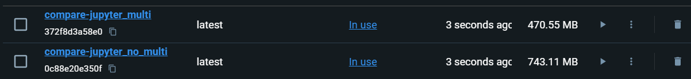

# <span>`What in Assignment`</span>

- ### 1. [`Docker`](#Docker)

- ### 2. [`Why Docker-Compose`](#docker-compose)

- ### 3. [`How to reduce Image Size in Docker`](#reduce-size)

# <span id="Docker">`EX1: Docker`</span>
## I create an container (contain multi containers) include Airflow, Postgres, Jupyter Notebook, Selenium Hub and MinIO.
- **What is the purpose of my app ?**
    - It uses `python` to create job on `airflow` and schedule it for weekly
    - Crawl data from `Ohitv.net` - a film website
        - Include:
            - Title, Links, Feature (Yes or No)
    - Then upload to `MinIO` (A storage like S3)
    - And make sure that the data still live when network or something error
        - I always backup in `postgres database` named `backup` after each crawl step
        - Data is contained in volumes of container and in local
    - `Jupyter Notebook` for using python if we don't have python in local
#
# <span id="docker-compose">`EX2: Why docker-compose?`</span>

- **`Easy to manage and understand`**: Just write in YAML file to define the service, version, network and volumes so it is easier in understanding and manage.

- **`Multi container`**: Docker Compose is an ideal way to manage an app or an container that contain many container and they are connect with each other. And decide that how they connect

- **`Easy to use`**: You can start, stop and build again all with just one command.

- **`Manage depend condition`**: With Docker Compose, we can set the depend for the service. So that we can make sure that it's just can run when the condition are satisfied 
    - **For example**: Airflow web server runs if and only if the postgres container runs
        ```yaml
        version: '3'

        services:
            airflow:
                image: apache/airflow
                depends_on:
                    postgres:
                        condition: service_healthy
        ```

- **`Environment variable and can override`**: You can set the environment variable for the service. And when you update or something, you can create a new YAML file with same container name. So when you run both. It will override the old one.
    - **`For example`**: 
        ### 1. docker-compose.yaml :
        ```yaml
        version: '3'

        services:
            airflow:
                image: apache/airflow
                environment:
                    AIRFLOW__CORE__EXECUTOR: LocalExecutor
        ```
        ### 2. docker-compose.override.yaml:
        ```yaml
        version: '3'

        services:
            airflow:
                image: apache/airflow
                environment:
                    AIRFLOW__CORE__EXECUTOR: CeleryExecutor
        ```
        ### So when you run command:
        ```bash
        docker-compose -f docker-compose.yaml -f docker-compose.override.yaml up -d
        ```
        #### ***=> It will override the airflow in docker-compose.yaml***

- **`Network setting`**: Docker compose will create a default network for app to make sure all container will use the same network. But you can set network to isolate each part of your app

- **`Volume Management`**: Docker Compose makes it easy to define and manage volumes for persisting data between container restarts. You can mount host directories or use Docker-managed volumes to store your application's data.
#
# <span id="reduce-size">`EX3: How to reduce the size of Docker images, containers?`</span>
## **Method 1** : Multi-Stage
To prove that multi stage can help to reduce image's size. I use Dockerfile of python 3.9 slim.



So you can see that ***Jupyter Notebook*** `with multi-stage` has smaller size than ***Jupyter Notebook*** `without multi-stage`

`Multi-stage` means you will divide Dockerfile into 2 stage. `Build Stage` and `Running Stage`
- `Build Stage`: You build the packages and dependencies.
- For example in my project
    ```dockerfile
    # Stage 1: Build environment with Python dependencies
    FROM python:3.9-slim as builder

    WORKDIR /app
    
    RUN apt-get update && \
        apt-get install -y --no-install-recommends \
        build-essential \
        && rm -rf /var/lib/apt/lists/*

    COPY test_requirement.txt .
    RUN pip install --no-cache-dir -r test_requirement.txt
    ```
- `Running Stage`: You set the environment and something you need to running. In this stage, you just need to get necessary things to run. Not all. This is the key that why multi-stage reduce image's size.
- For example in my project
    ``` dockerfile
    # Stage 2: Runtime environment with Jupyter Notebook
    FROM python:3.9-slim

    ENV NB_USER=trieu \
        NB_UID=1000 \
        HOME=/home/trieu \
        JUPYTER_TOKEN="12345"

    RUN adduser --disabled-password \
        --gecos "Default user" \
        --uid ${NB_UID} \
        ${NB_USER}

    WORKDIR ${HOME}

    RUN pip install --no-cache-dir notebook

    COPY --from=builder /usr/local/lib/python3.9/site-packages/ /usr/local/lib/python3.9/site-packages/

    USER ${NB_USER}

    EXPOSE 8887

    CMD ["jupyter", "notebook", "--ip=0.0.0.0", "--port=8888", "--no-browser", "--allow-root"]
    ```
#
## **Method 2**: Use suitable version of image (slim or alpine)

Each version of image will have a different size and adapt for suitable purpose
- For example:
    - If you use the image `python:3.10`. It will have bigger size than image `python:3.10-slim` or `python:3.10-alpine`.
    - If you don't need to have a lot of things in `python:3.10`. So `python:3.10-slim` or `python:3.10-alpine` is ideal choice for you, reduce size but still adapt for project or app
#
## **Method 3**: Use .dockerignore
To exclude unnecessary files and directories from being copied into the Docker image. This helps reduce the size of the context sent to the Docker daemon during the build process.

For example:

1. .dockerignore
    ```plaintext
    # Exclude Python bytecode files
    *.pyc

    # Exclude editor-specific files
    .vscode/
    .idea/

    # Exclude any virtual environment directories
    venv/
    env/
    .virtualenv/

    # Exclude any cache or temporary files
    __pycache__/
    .ipynb_checkpoints/
    .cache/
    ```

2. Dockerfile

    ``` Dockerfile
    FROM python:3.10-slim

    WORKDIR /app

    COPY . .

    RUN pip install jupyter

    EXPOSE 8888

    CMD ["jupyter", "notebook", "--ip=0.0.0.0", "--port=8888", "--no-browser", "--allow-root"]
    ```